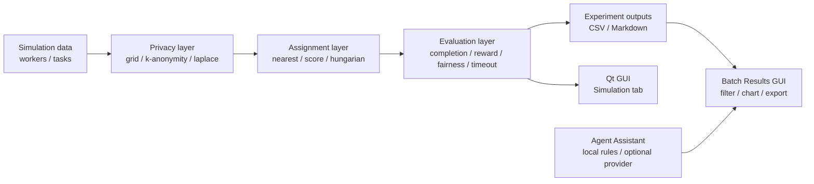

# GeoTaskShield

GeoTaskShield 是一个面向移动群智感知（Mobile Crowdsensing）的隐私保护任务分配仿真与可视化系统。项目用 C++20、CMake 和 Qt Widgets 构建，用可复现实验展示：在平台需要根据位置分配任务时，隐私保护机制会如何影响完成率、移动距离、系统收益、公平性、超时率和隐私损失。

当前工程版本为 `0.10.1`。`develop` 分支还包含 v0.10.1 之后新增的可复现实验计划和 Stress Scenario Suite。

## 当前能力

- 生成 worker 和 sensing task 仿真数据。
- 支持三类位置隐私机制：
  - `grid`
  - `k-anonymity`
  - `laplace`
- 支持三类任务分配算法：
  - `nearest`
  - `score`
  - `hungarian`
- 计算核心评估指标：
  - `completionRate`
  - `averageMovingDistance`
  - `totalReward`
  - `averagePrivacyLoss`
  - `algorithmRuntimeMs`
  - `userLoadStdDev`
  - `fairnessIndex`
  - `privacyUtilityRatio`
  - `timeoutRate`
- 运行单次仿真、固定批量实验、JSON plan 驱动实验。
- 输出 CSV / Markdown 报告。
- Qt GUI 支持：
  - 单次仿真地图和指标展示。
  - Batch Results CSV 加载、筛选、排序、图表、详情、导出。
  - Chart rows 控制：`Top 12`、`Top 24`、`Top 40`、`All`，默认 `Top 24`。
  - Stress suite 长标签自动压缩为可读短标签。
  - Agent Assistant 本地规则分析和可选 OpenAI-compatible provider。
- 命令行和 GUI 均有 CTest 覆盖。

## 适用场景

GeoTaskShield 适合用于课程设计、研究原型和工程演示，重点不是提供生产级调度服务，而是把以下问题变成可复现、可解释、可展示的实验：

- 使用真实位置可以提升任务匹配质量，但会泄露个人位置规律。
- 加噪、网格化、k 匿名等隐私机制会改变分配效果。
- 不同任务分配算法在收益、距离、公平性和超时上有不同偏好。
- 容量不足、deadline 压力、privacy noise、reward skew、worker speed heterogeneity 应分别建模，否则实验结论会被单一瓶颈掩盖。

## 仓库结构

```text
GeoTaskShield/
  agent/          Local rule-based assistant and optional OpenAI-compatible assistant
  app/            Console, batch, and agent demo entry points
  assignment/     Task assignment algorithms
  data/           Legacy CSV export
  evaluation/     Metric calculation
  experiment/     Batch runner, plan loader, CSV loader, reports, result model
  gui/            Qt Widgets UI
  model/          Core data structures
  privacy/        Privacy mechanisms
  simulation/     Data generation and simulation engine
  tests/          Qt-free core tests
docs/
  demo/           GUI demo guides
  examples/       Experiment plan examples
scripts/          Verification and packaging scripts
```

## 架构概览



设计边界：

- `model`、`simulation`、`privacy`、`assignment`、`evaluation`、`experiment`、`agent` 是 Qt-free C++ 模块。
- Qt 类型只出现在 `gui` 模块。
- 隐私机制只改变算法可见的 worker exposed location；评估仍使用真实位置计算真实移动距离和 timeout。
- `GeoTaskShieldBatchDemo --plan` 是当前推荐的可复现实验入口。

## 构建环境

推荐环境：

- Windows
- Visual Studio 2026 / MSVC toolchain
- CMake 3.16+
- Ninja
- Qt 6.11 MSVC kit（仅 GUI 构建需要）

当前 Qt preset 默认路径：

```text
D:/Qt/6.11.0/msvc2022_64
```

如果 Qt 安装路径不同，修改 `CMakePresets.json` 中 `x64-debug-qt` 和 `x64-release-qt` 的 `CMAKE_PREFIX_PATH`。

所有 MSVC 构建建议在 Visual Studio Developer Command Prompt 中运行，或先加载 `VsDevCmd.bat`。普通 PowerShell 如果没有 MSVC `INCLUDE` / `LIB` 环境，`cl.exe` 可能找不到标准库头文件。

## 构建与测试

### 一键本地验证

```powershell
powershell -NoProfile -ExecutionPolicy Bypass -File .\scripts\verify_phase14.ps1
```

### Core Debug

```powershell
cmd /c 'call "C:\Program Files\Microsoft Visual Studio\18\Enterprise\Common7\Tools\VsDevCmd.bat" -arch=x64 && cmake --preset x64-debug && cmake --build out\build\x64-debug && ctest --test-dir out\build\x64-debug --output-on-failure'
```

Core Debug 生成：

```text
out/build/x64-debug/GeoTaskShield/GeoTaskShield.exe
out/build/x64-debug/GeoTaskShield/GeoTaskShieldBatchDemo.exe
out/build/x64-debug/GeoTaskShield/GeoTaskShieldAgentDemo.exe
```

### Qt Debug

```powershell
cmd /c 'call "C:\Program Files\Microsoft Visual Studio\18\Enterprise\Common7\Tools\VsDevCmd.bat" -arch=x64 && cmake --preset x64-debug-qt && cmake --build out\build\x64-debug-qt && ctest --test-dir out\build\x64-debug-qt --output-on-failure'
```

Qt Debug 生成：

```text
out/build/x64-debug-qt/GeoTaskShield/GeoTaskShieldGui.exe
```

### Release Package

```powershell
powershell -ExecutionPolicy Bypass -File .\scripts\package_windows.ps1
```

默认输出：

```text
out/package/GeoTaskShield-v0.10.1-windows-x64.zip
```

## 运行方式

### 控制台单次/矩阵演示

```powershell
out\build\x64-debug\GeoTaskShield\GeoTaskShield.exe
```

### 固定批量实验

无参数运行会生成 legacy batch 输出：

```powershell
out\build\x64-debug\GeoTaskShield\GeoTaskShieldBatchDemo.exe
```

输出：

```text
phase5_batch_results.csv
phase5_batch_report.md
```

### JSON Experiment Plan

基础可复现实验：

```powershell
out\build\x64-debug\GeoTaskShield\GeoTaskShieldBatchDemo.exe --plan docs\examples\experiment_plan_basic.json
```

自定义输出目录：

```powershell
out\build\x64-debug\GeoTaskShield\GeoTaskShieldBatchDemo.exe --plan docs\examples\experiment_plan_basic.json --output runs\basic-check
```

每个 plan run 输出：

```text
results.csv
report.md
plan_snapshot.json
metadata.json
```

Plan 支持的主要字段：

| 字段 | 说明 |
|---|---|
| `name` | 实验计划名称 |
| `run_label` | 默认输出目录标签 |
| `workers` / `tasks` / `seeds` | 支持数组和数值 range object |
| `privacy` | `grid`、`k-anonymity`、`laplace` |
| `algorithms` | `nearest`、`score`、`hungarian` |
| `grid_size` / `k` / `epsilon` | 隐私参数 |
| `areaWidth` / `areaHeight` | 生成区域大小 |
| `data_profile` | 可选，默认 `default` |

## Stress Scenario Suite

Stress suite 用于展示非单一容量瓶颈下的实验权衡：

```powershell
out\build\x64-debug\GeoTaskShield\GeoTaskShieldBatchDemo.exe --plan docs\examples\experiment_plan_stress.json --output runs\stress-suite
```

`docs/examples/experiment_plan_stress.json` 当前展开为 180 个场景，组合：

- data profiles:
  - `worker-shortage`
  - `deadline-tight`
  - `high-privacy-noise`
  - `reward-skew`
  - `heterogeneous-speed`
- privacy:
  - `grid`
  - `k-anonymity`
  - `laplace`
- algorithms:
  - `nearest`
  - `score`
  - `hungarian`
- grid size:
  - `8`
  - `25`
- epsilon:
  - `0.25`
  - `1.0`

Profile 设计目的：

| Profile | 主要压力 |
|---|---|
| `worker-shortage` | 容量不足，产生 non-full completion |
| `deadline-tight` | 低 speed + 短 deadline，主要展示 timeout |
| `high-privacy-noise` | 展示 privacy loss、moving distance、privacyUtilityRatio 变化 |
| `reward-skew` | 展示 score / hungarian / nearest 的 totalReward 差异 |
| `heterogeneous-speed` | 展示 speed / capacity heterogeneity 对 timeout 和 fairness 的影响 |

Stress report 会额外生成：

- global stress summary
- per-profile summary
- non-full completion rows
- timeout pressure rows
- privacy-utility tradeoff
- reward and fairness ranges

## GUI 使用流程

启动：

```powershell
out\build\x64-debug-qt\GeoTaskShield\GeoTaskShieldGui.exe
```

### Simulation Tab

1. 设置 worker 数、task 数、隐私机制、算法和隐私参数。
2. 点击 `Run Simulation`。
3. 查看地图、assignment 连线、指标和日志。

### Batch Results Tab

1. 点击 `Open CSV`。
2. 加载 `phase5_batch_results.csv` 或 plan 输出的 `results.csv`。
3. 用 `Privacy` / `Algorithm` 筛选记录。
4. 用 `Metric` 切换柱状图指标。
5. 用 `Chart rows` 控制图表显示数量：
   - `Top 12`
   - `Top 24`（默认）
   - `Top 40`
   - `All`
6. 表格仍显示完整筛选结果，不受 chart row limit 影响。
7. 点击表头排序，右侧查看当前行详情。
8. 使用：
   - `Export Filtered CSV`
   - `Preview Markdown`
   - `Export Markdown`

Stress suite 结果通常有较多行。GUI 默认只在图表中显示 Top 24，并把 stress scenario 的长标签压缩成短码，例如：

```text
dead lap score
g8 k5 e0.25
```

### Agent Assistant Tab

1. 先在 `Batch Results` tab 加载 CSV。
2. 打开 `Agent Assistant` tab。
3. 选择 provider：
   - `Local rule-based`：默认、离线、无密钥。
   - `OpenAI Compatible`：可选，需要环境变量。
4. 输入自然语言分析请求。
5. 点击 `Analyze`。
6. 查看 intent preview 和 Markdown 分析。
7. 可导出 Markdown。

示例输入：

```text
Compare privacy mechanisms for 50 tasks and explain completion rate, privacy utility, privacy loss, and fairness.
```

```text
80 workers, 40 tasks, epsilon=0.5, use laplace and score greedy
```

## 可选 OpenAI-compatible Provider

默认不调用在线模型，不保存 API key。真实 provider 只在用户显式选择 `OpenAI Compatible` 并配置环境变量后使用。

推荐环境变量：

```powershell
$env:GTS_LLM_API_KEY = "<your API key>"
$env:GTS_LLM_MODEL = "deepseek-v4-flash"
$env:GTS_LLM_BASE_URL = "https://dashscope.aliyuncs.com/compatible-mode/v1"
$env:GTS_LLM_TIMEOUT_MS = "15000"
```

兼容旧变量：

```text
DASHSCOPE_API_KEY
DASHSCOPE_MODEL
DASHSCOPE_BASE_URL
DASHSCOPE_TIMEOUT_MS
```

优先级：

```text
GTS_LLM_* > DASHSCOPE_* > built-in defaults
```

安全约束：

- API key 只能保存在本机运行环境变量中。
- 不要把密钥写入源码、README、测试、报告、截图或提交记录。
- provider 失败、超时、空响应或结构异常时，GUI 会保留本地规则 fallback 分析，不中断界面。

## 测试目标

Core build 的 CTest：

```text
GeoTaskShieldCoreModelTests
GeoTaskShieldCoreAlgorithmTests
GeoTaskShieldCoreExperimentTests
GeoTaskShieldCoreAgentTests
```

Qt build 额外包含：

```text
GeoTaskShieldGuiSmokeTests
```

GUI smoke test 覆盖：

- 主窗口基本启动。
- Simulation tab 默认仿真。
- Batch Results CSV 加载、排序、导出、Markdown。
- 大量 stress-style rows 下 chart 默认 Top 24。
- x 轴标签抽样和 stress 短标签。
- Agent Assistant 本地分析和 missing-key fallback。

## 当前限制

- 项目使用轻量自定义断言测试，尚未迁移到 GoogleTest 或 Catch2。
- Laplace privacy 是仿真层坐标扰动，不是完整差分隐私证明系统。
- Hungarian 当前通过 worker slots 展开容量，不是多 worker 协同任务优化模型。
- GUI chart 是自绘轻量柱状图，没有引入 Qt Charts / Qt Graphs。
- Optional provider 是 OpenAI-compatible HTTP 接口入口，不保证所有第三方模型输出都能稳定解析。

## 版本记录入口

详细版本变更见：

```text
CHANGELOG.md
```

GUI 演示指南见：

```text
docs/demo/v0.10.0-gui-demo-guide.md
```

实验计划示例见：

```text
docs/examples/experiment_plan_basic.json
docs/examples/experiment_plan_stress.json
```

## License / Usage

本仓库当前作为课程、研究和工程演示项目维护。若用于论文、报告或二次开发，请在引用时说明 GeoTaskShield 的仿真假设和当前限制。
