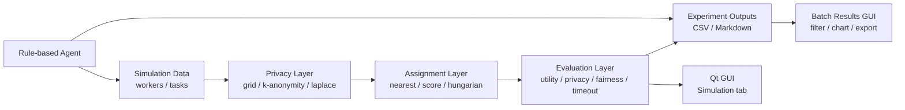

# GeoTaskShield

面向移动群智感知的隐私保护任务分配仿真与可视化系统
当前版本：`v0.10.1`

## 摘要

GeoTaskShield 是一个使用 C++20、CMake 和 Qt Widgets 构建的隐私保护任务分配仿真系统。项目围绕移动群智感知场景中的一个核心问题展开：平台需要把感知任务分配给移动用户，但任务分配又依赖用户位置、任务距离、奖励、可靠性和隐私预算等敏感因素。系统通过可复现实验、算法对比、GUI 可视化、批量结果分析和 Markdown/CSV 报告导出，展示“隐私保护机制如何影响任务完成率、系统收益、公平性和用户隐私损失”。

从技术路线看，GeoTaskShield 适合作为隐私计算、可信群智感知、C++ 软件工程、Qt GUI 系统开发和智能实验 Agent 的综合展示项目。当前版本已经形成可运行、可测试、可打包的桌面软件系统，并已经提供本地规则型 Agent、可选 OpenAI-compatible LLM provider、当前筛选结果分析和 Markdown/CSV 报告导出等智能实验辅助能力。

## 现实世界价值

GeoTaskShield 关注的问题在真实城市空间中很常见。例如在广州大学城这类高校、商业、交通和公共服务高度集中的片区，平台可能希望把道路拥堵观察、校园安全巡查、噪声采样、共享单车调度、突发事件上报或环境质量监测任务分配给附近的学生、教职工、骑手和志愿者。直接使用真实位置可以提升任务响应速度和完成率，但也可能泄露个人上课路线、宿舍区域、通勤规律或夜间活动范围。GeoTaskShield 的意义在于把这类现实矛盾转化为可重复实验：在不改变核心仿真语义的前提下，对比不同隐私保护机制和任务分配算法如何影响完成率、移动成本、系统收益、公平性和隐私损失，从而帮助研究者、平台设计者和城市治理团队在“效率”和“隐私”之间做出更有依据的权衡。

## 项目意义

移动群智感知系统通常依赖大量移动用户采集交通、噪声、空气质量、城市运行状态等数据。平台若直接使用真实位置进行任务分配，通常能获得更高任务完成率和更低移动成本；但真实位置也是高敏感隐私信息，可能暴露用户轨迹、生活区域和行为规律。

GeoTaskShield 将这一矛盾抽象为可实验、可展示、可扩展的软件系统：

- **研究问题可计算化**：用统一指标衡量完成率、移动距离、收益、隐私损失、算法耗时、负载均衡、公平性和超时率。
- **算法影响可比较**：支持多种隐私机制和任务分配算法的矩阵式对比。
- **结果解释可视化**：Qt GUI 展示单次仿真地图、批量实验摘要、图表和表格。
- **实验过程可复现**：固定随机种子、CSV/Markdown 导出和轻量测试让结果便于复查。
- **智能实验辅助已落地**：当前已有本地规则型 Agent、Agent Assistant、可选 OpenAI-compatible provider 和 Markdown 报告生成能力；默认离线可用，也可在用户显式配置环境变量后调用真实 LLM。

## 阶段化技术路线

### 第一阶段：C++ 软件开发、GUI 和系统开发

GeoTaskShield 当前版本主要体现以下能力：

- **现代 C++ 工程能力**：使用 C++20、接口抽象、策略模式、工厂创建、Qt-free 核心模块和独立 GUI 模块。
- **算法系统实现能力**：实现多种隐私保护机制、任务分配算法和指标计算逻辑。
- **Qt Widgets GUI 开发能力**：提供参数面板、二维地图绘制、结果面板、日志面板和批量结果分析页。
- **实验平台能力**：支持控制台实验、批量实验、CSV/Markdown 报告和 Windows 打包发布。
- **工程交付能力**：提供 CMake Presets、Debug/Release 构建、CTest 验收、版本发布和演示指南。

### 第二阶段：大语言模型与 Agent 开发

GeoTaskShield 当前已经具备智能实验助手的核心产品路径：

- 当前 `agent` 模块支持自然语言实验请求解析。
- 当前 `ReportGenerator` 支持 Markdown 报告生成。
- 当前 GUI 已支持 Markdown 报告预览、导出和 `Agent Assistant` 自然语言分析入口。
- 当前 `Agent Assistant` 默认使用本地规则型分析，并提供可选 OpenAI-compatible provider。
- 真实 provider 只在用户显式选择并配置运行时环境变量后调用，可用于解释当前 Batch Results、生成对比结论和提出下一轮实验建议。

默认实现刻意不调用在线模型、不保存 API key。可选 OpenAI-compatible provider 通过运行时环境变量读取密钥，例如 `GTS_LLM_API_KEY`，避免把密钥写入源码、文档、测试或提交记录。

## 系统能力概览

GeoTaskShield 当前支持：

- 生成模拟 worker 和 sensing task。
- 对 worker 位置进行隐私保护：
  - Grid Privacy（网格隐私）
  - K-Anonymity Privacy（K 匿名隐私）
  - Laplace Noise Privacy（拉普拉斯噪声隐私）
- 使用不同任务分配算法完成匹配：
  - Nearest Greedy（最近邻贪心算法）
  - Score Greedy（评分贪心算法）
  - Hungarian（匈牙利算法）
- 计算实验指标：
  - completed task count（已完成任务数）
  - completion rate（任务完成率）
  - average true moving distance（平均真实移动距离）
  - total reward（总收益）
  - average privacy loss（平均隐私损失）
  - algorithm runtime（算法运行时间）
  - worker load standard deviation（工作者负载标准差）
  - Jain fairness index（Jain 公平性指数）
  - privacy-utility ratio（隐私-效用比）
  - timeout rate（超时率）
- 运行控制台 3 x 3 隐私机制/分配算法对比实验。
- 导出控制台实验 CSV：`phase2_results.csv`。
- 运行批量实验并导出：
  - `phase5_batch_results.csv`
  - `phase5_batch_report.md`
- 提供 Qt Widgets GUI：
  - `Simulation` tab：单次仿真参数、地图、指标和日志。
  - `Batch Results` tab：加载批量 CSV、筛选、排序、摘要卡片、柱状图、当前行详情。
  - `Agent Assistant` tab：输入自然语言请求，预览结构化实验意图，并基于当前 Batch Results 筛选结果生成 Markdown 分析。
  - `Export Filtered CSV`：导出当前筛选后的批量结果。
  - `Preview Markdown`：预览当前筛选结果的 Markdown 报告。
  - `Export Markdown`：导出当前筛选结果的 Markdown 报告。
  - `Agent Assistant Export Markdown`：导出智能实验助手生成的 Markdown 分析。
- 提供本地规则型实验 Agent：
  - 自然语言请求解析。
  - 实验运行。
  - Markdown 报告生成。
- 提供本地规则型智能实验助手：
  - 解析 workers、tasks、privacy、algorithm、metric 和 compare intent。
  - 基于当前 Batch Results 筛选记录总结最佳完成率、最佳隐私效用比、最低隐私损失和最佳公平性。
  - 生成后续实验建议。

## 技术架构

项目保持“核心算法层 Qt 无关、GUI 层只负责交互展示”的边界。



核心模块：

| 模块 | 作用 |
|---|---|
| `model` | 任务、worker、位置、配置和 assignment 数据结构 |
| `simulation` | 数据生成与单次仿真编排 |
| `privacy` | 位置隐私保护策略和工厂 |
| `assignment` | 任务分配算法策略和工厂 |
| `evaluation` | 任务完成率、收益、隐私损失、公平性等指标计算 |
| `data` | 控制台实验 CSV 导出 |
| `experiment` | 批量实验、批量 CSV 加载、筛选模型、报告字符串生成 |
| `agent` | 本地自然语言配置解析、实验 Agent、Markdown 报告生成 |
| `gui` | Qt Widgets GUI、地图绘制、批量结果页面和导出入口 |

## 关键技术点

### 1. 隐私保护任务分配抽象

系统将 worker 的真实位置与暴露位置分离。隐私机制只改变分配算法可见的位置，评价指标仍能基于真实位置计算实际移动成本和隐私损失。这样可以同时观察“平台可用性”和“用户隐私保护”的张力。

### 2. 策略模式与工厂模式

隐私机制和分配算法均通过接口抽象：

- `IPrivacyMechanism`
- `IAssignmentAlgorithm`
- `PrivacyFactory`
- `AssignmentAlgorithmFactory`

这让新增算法时不需要改动 GUI 或仿真主流程，只需要实现新策略并注册到工厂。

### 3. 可复现实验与批量评估

批量实验使用固定随机种子生成场景，除算法运行时间外，实验结果具有稳定复现性。CSV 加载器支持常见字段别名、UTF-8 BOM、CRLF/LF、quoted fields，并对缺列和非法数字给出明确错误信息。

### 4. GUI 与核心解耦

`model`、`simulation`、`privacy`、`assignment`、`evaluation`、`data`、`agent` 和 `experiment` 均为纯 C++ 模块；Qt 类型只出现在 `gui` 模块。这种边界有利于测试、复用和后续迁移。

### 5. Agent 可演进路线

当前 Agent 默认使用本地规则型实现，避免依赖网络和密钥；同时提供可选 OpenAI-compatible provider，用于在用户显式配置环境变量后接入真实 LLM。后续可在不破坏系统主干的情况下继续增强：

- 更完整的 LLM prompt 到实验配置结构化解析。
- 更细粒度的实验结果自动解释和摘要。
- 多轮实验上下文和建议生成。
- 更多 provider preset 和模型配置入口。

## 当前发布版本

当前 release：`v0.10.1`

`v0.10.1` 是 Phase 14 稳定化补丁版本，在不改变运行时语义的前提下固化 provider 泛化、测试拆分、验证脚本和发布文档卫生。`v0.10.0` 已固化 Phase 13 的真实 LLM provider 产品化体验：

- `Batch Results` 当前筛选 CSV 导出。
- Markdown 报告预览。
- Markdown 报告导出。
- `Agent Assistant` 本地规则分析、Markdown 预览和导出。
- 可选 OpenAI-compatible provider，默认不作为主演示依赖，并支持超时配置、失败回退和 GUI 非阻塞分析。
- Qt-free 批量结果 CSV/Markdown 字符串生成。
- v0.10.x GUI 演示指南。

发布包默认输出：

```text
out/package/GeoTaskShield-v0.10.1-windows-x64.zip
```

## 构建环境

推荐环境：

- Windows
- Visual Studio 2026 with MSVC toolchain
- CMake
- Ninja
- Qt 6.11 MSVC kit

当前 Qt preset 期望路径：

```text
D:/Qt/6.11.0/msvc2022_64
```

如果 Qt 安装路径不同，需要修改 `CMakePresets.json` 中的 `CMAKE_PREFIX_PATH`。

## 构建与测试

从项目根目录执行。推荐使用 Visual Studio Developer Command Prompt，或在 PowerShell 中调用 `VsDevCmd.bat`。

Phase 14 后可用本地验收脚本一次运行非 Qt 与 Qt Debug 检查：

```powershell
powershell -NoProfile -ExecutionPolicy Bypass -File .\scripts\verify_phase14.ps1
```

### 非 Qt Debug 构建与核心测试

```powershell
cmd /c 'call "C:\Program Files\Microsoft Visual Studio\18\Enterprise\Common7\Tools\VsDevCmd.bat" -arch=x64 && cmake --preset x64-debug && cmake --build out\build\x64-debug && ctest --test-dir out\build\x64-debug --output-on-failure'
```

运行控制台对比实验：

```powershell
out\build\x64-debug\GeoTaskShield\GeoTaskShield.exe
```

### Experiment plan runs

`GeoTaskShieldBatchDemo` still supports the legacy no-argument batch run and writes:

```text
phase5_batch_results.csv
phase5_batch_report.md
```

It can also run a reproducible experiment plan from a small hand-written JSON file:

```powershell
out\build\x64-debug\GeoTaskShield\GeoTaskShieldBatchDemo.exe --plan docs\examples\experiment_plan_basic.json
```

The basic plan is intended to stay small and reproducible. For defense and research demos that need visible tradeoffs, run the Stress Scenario Suite:

```powershell
out\build\x64-debug\GeoTaskShield\GeoTaskShieldBatchDemo.exe --plan docs\examples\experiment_plan_stress.json --output runs\stress-suite
```

The stress plan combines worker shortage, tight-deadline, high-privacy-noise, reward-skew, and heterogeneous-speed data profiles across `nearest`, `score`, and `hungarian` assignment with `grid`, `k-anonymity`, and `laplace` privacy. Worker shortage provides explicit capacity pressure, while the other profiles keep enough assignment capacity to expose timeout, privacy-utility, reward, and fairness tradeoffs in `results.csv` and `report.md` without changing the legacy no-argument batch run.

By default, plan-driven runs are archived under `runs/<run_label-or-plan-name>/`. A custom archive directory can be selected with `--output`:

```powershell
out\build\x64-debug\GeoTaskShield\GeoTaskShieldBatchDemo.exe --plan docs\examples\experiment_plan_basic.json --output runs\my-run
```

If the same `run_label` or `--output` directory is reused, the runner overwrites the same output filenames in that directory. Use a different `run_label` or `--output` path when you need to keep multiple archives side by side.

Each run directory contains:

```text
results.csv
report.md
plan_snapshot.json
metadata.json
```

Plan files support list values such as `[50, 100]` and numeric range objects such as `{"start": 50, "end": 100, "step": 50}` for numeric fields. The supported strategy values are `grid`, `k-anonymity`, `laplace`, `nearest`, `score`, and `hungarian`. With the same plan and seeds, core result columns are deterministic; `algorithm_runtime_ms` and metadata timestamps can vary between runs.

### Qt Debug 构建与 GUI smoke test

```powershell
cmd /c 'call "C:\Program Files\Microsoft Visual Studio\18\Enterprise\Common7\Tools\VsDevCmd.bat" -arch=x64 && cmake --preset x64-debug-qt && cmake --build out\build\x64-debug-qt && ctest --test-dir out\build\x64-debug-qt --output-on-failure'
```

运行 GUI：

```powershell
out\build\x64-debug-qt\GeoTaskShield\GeoTaskShieldGui.exe
```

### Release 构建与 Windows 打包

```powershell
cmd /c 'call "C:\Program Files\Microsoft Visual Studio\18\Enterprise\Common7\Tools\VsDevCmd.bat" -arch=x64 && cmake --preset x64-release-qt && cmake --build out\build\x64-release-qt'
```

```powershell
powershell -ExecutionPolicy Bypass -File .\scripts\package_windows.ps1
```

打包输出：

```text
out/package/GeoTaskShield-v0.10.1-windows-x64.zip
```

发布包包含用户文档、demo CSV/Markdown 和 `docs/demo/`，不包含 `docs/superpowers/history/` 中的历史规划记录。

## GUI 演示流程

### Simulation tab

1. 启动 `GeoTaskShieldGui.exe`。
2. 在左侧设置 worker 数量、task 数量、grid size、k、epsilon、隐私机制和分配算法。
3. 点击 `Run Simulation`。
4. 观察地图中的 worker、暴露位置、task 和 assignment 连线。
5. 查看右侧指标和底部日志。

### Batch Results tab

1. 打开 `Batch Results` tab。
2. 点击 `Open CSV`。
3. 选择 `phase5_batch_results.csv`。
4. 使用 Privacy / Algorithm 下拉框筛选结果。
5. 使用 Metric 下拉框切换柱状图指标。
6. 点击表头排序，并查看当前行详情。
7. 点击 `Export Filtered CSV` 导出当前筛选结果。
8. 点击 `Preview Markdown` 预览当前筛选结果报告。
9. 点击 `Export Markdown` 导出 Markdown 报告。

### Agent Assistant tab

1. 先在 `Batch Results` tab 加载 `phase5_batch_results.csv`，并按需设置 Privacy / Algorithm 筛选。
2. 打开 `Agent Assistant` tab。
3. 在自然语言输入框中输入实验分析请求，例如：

```text
Compare privacy mechanisms for 50 tasks and explain completion rate, privacy utility, privacy loss, and fairness.
```

4. 点击 `Analyze`。
5. 查看解析出的实验意图和 Markdown 分析结果。
6. 点击 `Export Markdown` 导出助手生成的 Markdown 分析。

详细演示脚本见：

```text
docs/demo/v0.10.0-gui-demo-guide.md
```

### 可选 LLM provider（Phase 12）

`Agent Assistant` 默认使用 `Local rule-based`，因此 GUI 在没有网络访问、没有凭据的情况下仍可正常工作。如需使用 OpenAI-compatible 服务，在 provider 下拉框中选择 `OpenAI Compatible`，并在启动程序前配置以下环境变量：

```powershell
$env:GTS_LLM_API_KEY = "<your API key>"
$env:GTS_LLM_MODEL = "deepseek-v4-flash"
$env:GTS_LLM_BASE_URL = "https://dashscope.aliyuncs.com/compatible-mode/v1"
$env:GTS_LLM_TIMEOUT_MS = "15000"
```

真实 provider 必须配置 `GTS_LLM_API_KEY`。`GTS_LLM_MODEL` 默认使用 `deepseek-v4-flash`，`GTS_LLM_BASE_URL` 默认使用 DashScope 的 OpenAI-compatible endpoint，`GTS_LLM_TIMEOUT_MS` 默认使用 `15000` 毫秒。旧版 `DASHSCOPE_API_KEY`、`DASHSCOPE_MODEL`、`DASHSCOPE_BASE_URL`、`DASHSCOPE_TIMEOUT_MS` 仍作为兼容 fallback；当 `GTS_LLM_*` 和 `DASHSCOPE_*` 同时存在时，优先使用 `GTS_LLM_*`。API key 必须只保存在本机运行环境变量中，不得写入源码、文档、测试、报告或提交记录。

如果真实 provider 缺少 API key、请求失败、超时、返回空内容或返回非预期结构，`Agent Assistant` 会显示本地规则分析 fallback，而不是中断 GUI。真实 provider 分析在 GUI 后台线程中执行，点击 `Analyze` 后界面会显示 provider 状态，避免窗口在网络请求期间阻塞。

## 示例自然语言 Agent 输入

```text
100 个用户，50 个任务，k=5，使用匈牙利算法
80 workers, 40 tasks, epsilon=0.5, use laplace and score greedy
对比三种隐私机制，50个用户，20个任务，使用最近贪心
```

默认 Agent 使用本地规则解析；`Agent Assistant` 可选接入 OpenAI-compatible provider，但只有用户显式选择并配置环境变量时才会调用在线服务。

## 版本演进

| 阶段 | 内容 |
|---|---|
| Phase 1 | 控制台 MVP 仿真链路 |
| Phase 2 | 多隐私机制、多分配算法、CSV 导出 |
| Phase 3 | Qt Widgets 单次仿真 GUI |
| Phase 4 | 本地规则型 Agent 和 Markdown 报告 |
| Phase 5 | 批量实验、扩展指标、批量 CSV/Markdown |
| Phase 6 | 工程整理、Release preset、Windows 打包 |
| Phase 7 | GUI Batch Results 数据加载、筛选、图表和表格 |
| Phase 8 | `v0.7.0` Release and Demo Hardening |
| Phase 9 | GUI 筛选 CSV 导出、Markdown 预览/导出 |
| Phase 10 | `v0.8.0` Release and Demo Hardening |
| Phase 11 | 离线智能实验助手、GUI 自然语言入口、当前 Batch Results 本地分析 |
| Phase 12 | Optional OpenAI-compatible LLM provider for Agent Assistant, default-off and environment-variable configured |
| Phase 13 | Agent provider hardening: timeout configuration, fallback handling, and non-blocking GUI provider analysis |
| Demo Readiness | `v0.9.0` Release hardening, demo guide, package verification |
| v0.10.0 Release | Phase 13 provider hardening release package and demo guide |
| v0.10.1 Release | Phase 14 stabilization, focused core tests, release hygiene, and provider-generalization documentation |

## 当前限制

- 核心测试使用轻量自定义断言，并已拆分为 model、algorithm、experiment 和 agent 四个 CTest 目标；尚未迁移到 GoogleTest 或 Catch2。
- Hungarian 算法当前支持一任务对应一个展开 worker slot，不是严格多 worker 协同任务优化模型。
- Laplace 隐私是仿真层面的坐标扰动，不是完整差分隐私证明实现。
- Agent 和 Agent Assistant 默认使用本地规则型实现；OpenAI-compatible provider 为可选入口，只从环境变量读取 API key 和运行时配置，不保存密钥。
- Batch Results 图表使用自绘轻量柱状图，尚未引入 Qt Graphs 或 Qt Charts。

## 后续扩展建议

面向下一阶段智能化扩展，可以优先考虑：

- 支持多轮实验助手上下文和更细粒度的参数建议。
- 评估是否从当前轻量自定义断言迁移到 GoogleTest/Catch2。
- 支持更多隐私保护机制和任务分配算法。
- 引入持续集成流程和更系统的发布检查。

## 仓库与文档

- `HANDOFF.md`：阶段交接、构建验收、设计约束。
- `CHANGELOG.md`：版本更新记录。
- `docs/demo/`：GUI 演示指南。
- `phase5_batch_results.csv`：批量实验示例结果。
- `phase5_batch_report.md`：批量实验示例 Markdown 报告。
- `docs/superpowers/history/`：历史 Agent 规划记录，不属于发布包用户文档。

## 说明

本项目是围绕移动群智感知、位置隐私保护、任务分配仿真和智能实验辅助构建的技术展示型实现，重点体现 C++ 软件工程、GUI 系统开发、隐私保护算法实验和 Agent 扩展潜力。
